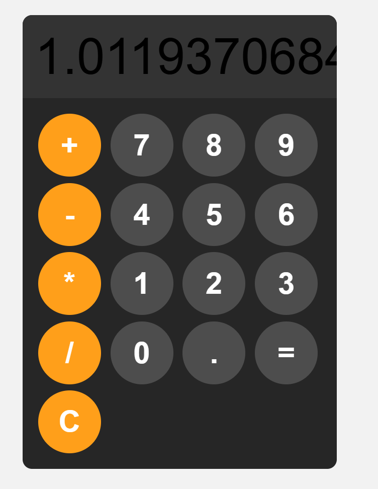

# 🧮 Calculator Project

A responsive calculator built with HTML, CSS & JavaScript. Clean UI with basic arithmetic operations + keyboard support.

## ✨ Features
- **Basic operations**: `+`, `-`, `*`, `/` 
- **Decimal support**: Handles `.` for float numbers
- **Clear button**: Reset the display instantly
- **Responsive design**: Works on desktop + mobile
- **Clean UI**: Dark theme with orange operator buttons

## 🛠️ Tech Stack
- **HTML5** - Structure
- **CSS3** - Styling & layout  
- **JavaScript (ES6)** - Logic & DOM manipulation

No frameworks or libraries used.

## 🚀 How to Run
1. Clone the repo: `git clone https://github.com/NallaballeAnuha/Calculator-project.git`
2. Open `index.html` in your browser
3. Start calculating!

## 📸 Screenshot

## 🔮 Future Improvements
- [ ] Keyboard input support
- [ ] Calculation history 
- [ ] Scientific mode: sin, cos, tan

## 👩‍💻 About Me
Beginner frontend developer building projects to learn HTML, CSS & JavaScript.

## 🔗 Live Demo
https://nallaballeanuha.github.io/Calculator-project/

**Connect with me:** 
- Email:nallaballeanuha@gmail.com
